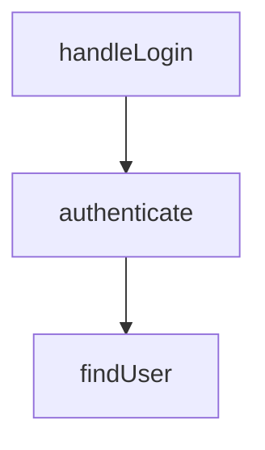

# /project-mapper:flow-tracer

Trace code flow, call chains, and data flow through the codebase.

## Usage

```
/project-mapper:flow-tracer [command] [target] [options]
```

## Commands

| Command | Description |
|---------|-------------|
| `trace [feature]` | Trace full feature flow |
| `chain [file:func]` | Function call chain |
| `data [variable]` | Variable/data flow |

## Options

| Option | Default | Description |
|--------|---------|-------------|
| `--format` | text | text / detailed / mermaid |
| `--depth` | 3 | Trace depth (1-5) |
| `--direction` | down | down / up / both |

## Examples

```bash
# Trace login feature
/project-mapper:flow-tracer trace login

# Function call chain
/project-mapper:flow-tracer chain src/auth.ts:authenticate --depth 2

# Mermaid diagram
/project-mapper:flow-tracer trace auth --format mermaid

# Reverse trace (who calls this?)
/project-mapper:flow-tracer chain src/db.ts:findUser --direction up

# Track variable usage
/project-mapper:flow-tracer data userId
```

## Output Formats

### text (default)
```
handleLogin → authenticate → findUser → verifyPassword
           → createSession → generateToken
```

### detailed
```markdown
## Step 1: api/handler.ts:handleLogin (line 10)
- Receives: { email, password }
- Calls: authenticate(email, password) at line 15
...
```

### mermaid

