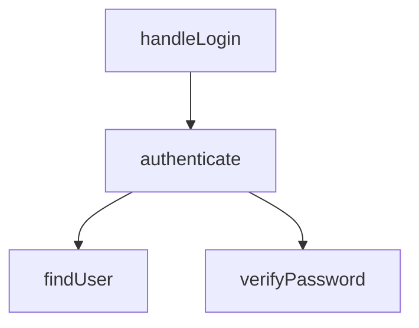

# Flow Tracer

Trace code flow and call chains with multiple output formats.

## Purpose

- "How does login flow work?"
- "What functions does authenticate() call?"
- "Where does this variable get used?"
- Visualize call chains as text or Mermaid diagrams

## Commands

| Command | Description |
|---------|-------------|
| `trace [feature]` | Trace full feature flow |
| `chain [file:func]` | Function call chain |
| `data [variable]` | Variable/data flow |

## Options

| Option | Default | Description |
|--------|---------|-------------|
| `--format` | text | text / detailed / mermaid |
| `--depth` | 3 | Trace depth (1-5) |
| `--direction` | down | down / up / both |
| `--model <m>` | (agent default) | Override agent model |

## Usage

```
/project-mapper:flow-tracer trace login
/project-mapper:flow-tracer chain src/auth.ts:authenticate --depth 2
/project-mapper:flow-tracer trace auth --format mermaid
/project-mapper:flow-tracer chain src/db.ts:findUser --direction up
/project-mapper:flow-tracer data userId
```

---

## Iron Law

**YOU MUST DELEGATE.** You are an orchestrator, NOT a worker.

You MUST spawn the required agent via a Task call. You MUST NOT:
- Analyze code yourself
- Search for call chains yourself
- Skip agent spawning for any reason
- Perform the agent's work "because it seems simple"
- Pre-validate whether the target exists before spawning
- Use Grep/Read/Glob to check if a feature or function exists

**ALWAYS spawn the agent.** Even if the target seems nonexistent, let the agent search and report back.

**Agent for this skill:**

| Agent | Qualified Name | Role |
|-------|---------------|------|
| flow-tracer | `project-mapper:flow-tracer` | Trace code flow and call chains |

---

## Pre-flight

**Your FIRST action MUST be:**

1. Read `.claude/map.md` and `.claude/design.md` — do this IMMEDIATELY, before parsing input
2. If either is missing → inform user: "Run `/project-mapper:map init` first" and STOP
3. Do NOT proceed without project context

---

## The Process

### Step 1: Parse Input

Extract:
- Command type (trace/chain/data)
- Target (feature name, file:func, variable)
- Options (format, depth, direction, model)

### Step 2: Invoke Agent

Launch **exactly ONE** Task call.

**CRITICAL:** subagent_type MUST use fully qualified name `"project-mapper:flow-tracer"`.

```
Task(
  subagent_type: "project-mapper:flow-tracer",
  model: {model},
  prompt: "[command] [target] depth=[n] direction=[dir] format=[fmt]

  Context from map.md:
  {map.md contents}

  Context from design.md:
  {design.md contents}
  "
)
```

Note: `{model}` = user-specified via `--model` or omit for agent default.

Wait for the agent to return before formatting output.

### Step 3: Format Output

Transform agent JSON based on `--format`:

**text (default):** Simple arrow chain
```
handleLogin → authenticate → findUser → verifyPassword
           → createSession → generateToken
```

**detailed:** Step-by-step breakdown with file:line references, data flow tracking

**mermaid:** Flowchart diagram


### Step 4: STOP

**This skill ends here.** Do NOT start implementing, fixing, or acting on results.
Wait for user's next instruction.

---

## Common Mistakes

| Mistake | Correction |
|---------|------------|
| Bare agent name `"flow-tracer"` | Fully qualified `"project-mapper:flow-tracer"` |
| Searching code with Grep/Read yourself | ALWAYS spawn agent, even for "simple" traces |
| Pre-validating target before spawning | Let agent handle validation and error messages |
| Skipping .claude/ pre-loading | ALWAYS Read map.md and design.md FIRST |
| Retrying denied permissions 5+ times | After 2 failures, inform user and ask |
| Output without agent result | Output MUST be based on agent's returned data |

---

## Red Flags

If you find yourself doing any of these, STOP and re-read the Iron Law:

- Using Read/Grep/Glob to analyze code instead of spawning a Task
- Using bare agent names without `project-mapper:` prefix
- Skipping pre-flight .claude/ doc loading
- Continuing after pre-flight failure
- Writing code or fixing issues after displaying results

---

## Error Handling

### Entry not found
```
Entry point not found for "login"

Searched: ["login", "handleLogin", "loginHandler"]

Did you mean:
- src/auth/login.ts:handleUserLogin
- src/api/auth.ts:processLogin
```

### Depth exceeded
```
handleLogin → authenticate → findUser → [depth limit reached]

Use --depth 5 to trace deeper.
```

---

## Related Skills

- `project-mapper:query` - Answer project questions
- `project-mapper:elaborate` - Break down requirements

## MCP Tools

- `mcp__code-search__search_code`: Find entry points
- Agent uses: Read, Grep, Glob for chain tracing
