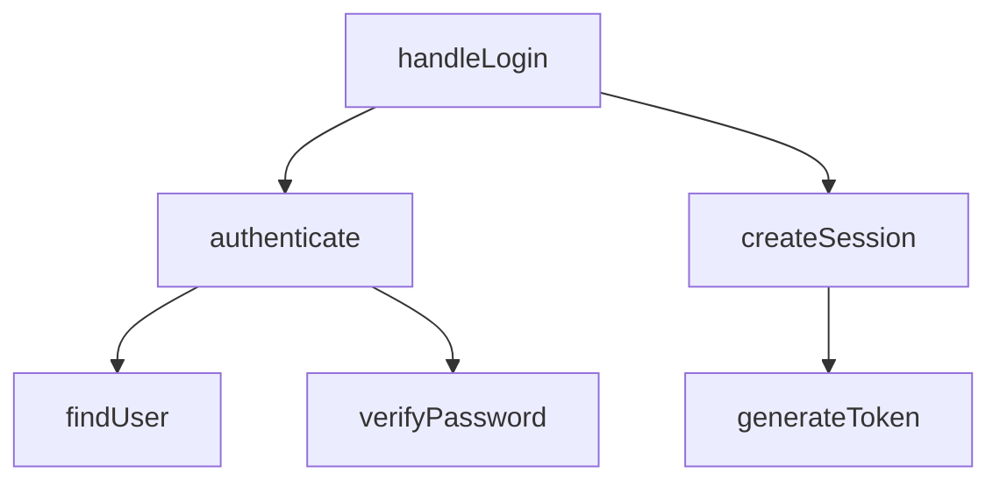

# Flow Tracer

Trace code flow and call chains with multiple output formats.

## Purpose

- "How does login flow work?"
- "What functions does authenticate() call?"
- "Where does this variable get used?"
- Visualize call chains as text or Mermaid diagrams

## Usage

```
/project-mapper:flow-tracer trace [feature]
/project-mapper:flow-tracer chain [file:func]
/project-mapper:flow-tracer data [variable]
```

## Commands

| Command | Description |
|---------|-------------|
| `trace [feature]` | Trace full feature flow |
| `chain [file:func]` | Function call chain |
| `data [variable]` | Variable/data flow |

## Options

| Option | Default | Description |
|--------|---------|-------------|
| `--format` | text | text / detailed / mermaid |
| `--depth` | 3 | Trace depth (1-5) |
| `--direction` | down | down / up / both |

## Examples

```bash
# Trace login feature flow
/project-mapper:flow-tracer trace login

# Function call chain with depth 2
/project-mapper:flow-tracer chain src/auth.ts:authenticate --depth 2

# Mermaid diagram output
/project-mapper:flow-tracer trace auth --format mermaid

# Who calls this function (reverse trace)
/project-mapper:flow-tracer chain src/db.ts:findUser --direction up

# Track a variable
/project-mapper:flow-tracer data userId
```

## Workflow

### 1. Parse Command

Extract:
- Command type (trace/chain/data)
- Target (feature name, file:func, variable)
- Options (format, depth, direction)

### 2. Invoke Agent

Call flow-tracer agent with parameters:
```
Task: flow-tracer agent
Prompt: [command] [target] depth=[n] direction=[dir]
```

### 3. Format Output

Transform agent JSON based on `--format`:

## Output Formats

### text (default)

Simple arrow chain:
```
handleLogin → authenticate → findUser → verifyPassword
           → createSession → generateToken
```

### detailed

Step-by-step breakdown:
```markdown
## Flow: login

### Step 1: api/handler.ts:handleLogin (line 10)
- Receives: { email, password }
- Calls: authenticate(email, password) at line 15

### Step 2: services/auth.ts:authenticate (line 20)
- Receives: email, password
- Calls: findUser(email) at line 25
- Calls: verifyPassword(user, password) at line 30
- Returns: { user, token }

### Step 3: db/users.ts:findUser (line 5)
- Receives: email
- Returns: User | null

### Data Flow
- email: handler.ts:10 → auth.ts:20 → users.ts:5
- user: users.ts:8 → auth.ts:28 → handler.ts:18
```

### mermaid

Flowchart diagram:


## Format Conversion

### JSON to Text

```python
def to_text(chain):
    lines = []
    current = chain[0]["caller"]
    callees = [c["callee"] for c in chain if c["caller"] == current]
    lines.append(f"{current} → {' → '.join(callees)}")
    # Continue for nested calls
    return '\n'.join(lines)
```

### JSON to Mermaid

```python
def to_mermaid(chain):
    nodes = {}
    edges = []
    for c in chain:
        caller_id = to_node_id(c["caller"])
        callee_id = to_node_id(c["callee"])
        nodes[caller_id] = c["caller"].split(":")[-1]
        nodes[callee_id] = c["callee"].split(":")[-1]
        edges.append(f"    {caller_id} --> {callee_id}")

    header = "flowchart TD"
    node_defs = [f"    {k}[{v}]" for k, v in nodes.items()]
    return '\n'.join([header] + node_defs + edges)
```

## Direction Examples

### down (default)
What does this function call?
```
/project-mapper:flow-tracer chain src/api.ts:handleRequest --direction down

handleRequest → validateInput → processData → saveResult
```

### up
Who calls this function?
```
/project-mapper:flow-tracer chain src/db.ts:saveResult --direction up

saveResult ← processData ← handleRequest ← router
```

### both
Full context around function:
```
/project-mapper:flow-tracer chain src/auth.ts:validate --direction both

Callers: login, register, middleware
validate
Callees: checkToken, refreshToken
```

## Error Handling

### Entry not found
```
Entry point not found for "login"

Searched: ["login", "handleLogin", "loginHandler"]

Did you mean:
- src/auth/login.ts:handleUserLogin
- src/api/auth.ts:processLogin
```

### Depth exceeded
```
handleLogin → authenticate → findUser → [depth limit reached]

Use --depth 5 to trace deeper.
```

## MCP Tools

- `mcp__code-search__search_code`: Find entry points
- Agent uses: Read, Grep, Glob for chain tracing

## Quality Rules

1. **Validate target** - check file:func exists before tracing
2. **Show progress** - for deep traces, indicate progress
3. **Handle cycles** - mark recursive/circular calls
4. **Cross-file links** - show full paths in detailed format
